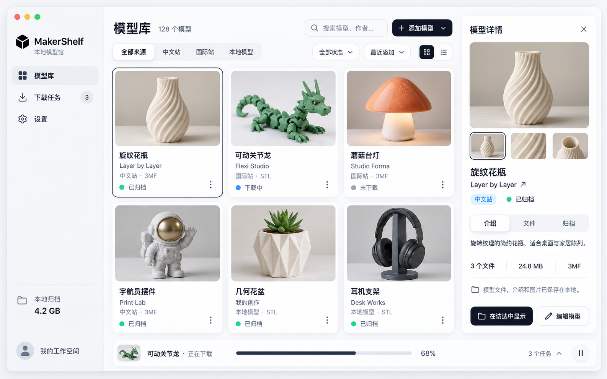

# MakerShelf · MakerWorld 本地模型馆

[](https://www.apple.com/macos/)
[](https://www.swift.org/)
[](LICENSE)
[](https://github.com/pengyucui/MakerShelf/releases)

MakerShelf 是原生 SwiftUI macOS 模型管理应用。将 MakerWorld 中文站、国际站的模型文件、介绍与图片归档到本机，也可以添加、编辑和整理自己的模型。

## 界面预览



## 获取 2.0

前往 [MakerShelf 2.0 Release](https://github.com/pengyucui/MakerShelf/releases/tag/v2.0) 查看版本说明与可用下载。

- 系统要求：**macOS 14 或更新版本**，支持 Apple Silicon 与 Intel。
- 自动发布资产：`MakerShelf-2.0-unsigned-macOS.zip`，附带 SHA-256 校验文件；资产在发布工作流成功后提供。
- 当前自动构建未经过 Developer ID 签名和 Apple 公证，macOS 可能限制直接打开；也可从源码运行。
- 完整更新记录见 [CHANGELOG](CHANGELOG.md)。

## 主要功能

| 功能 | 说明 |
| --- | --- |
| 模型库 | 网格 / 列表浏览，搜索、来源、作者、分类与归档状态筛选，支持排序和分页 |
| 模型详情 | 图片与完整图文介绍、模型文件、归档信息、来源链接；窄窗口使用详情弹窗 |
| 站点导入 | 单模型链接、当前账号收藏 / 发布内容、指定作者的公开作品 |
| 本地模型 | 拖放或选择文件，新建与编辑资料、模型文件、封面和展示图片 |
| 下载管理 | 进度、暂停、继续、取消与重试；同来源去重、并发上限和下载摘要 |
| 文件预览 | 3MF 包内图片，STL / OBJ 静态几何预览；支持放大与失败重试 |
| 图片归档 | 展示图优先压缩为最长边 1600 像素的 WebP，失败回退 JPEG 或原文件 |
| 运行日志 | 本地保存，支持级别、模块、关键词和本次运行筛选，以及复制、导出与清空 |
| 账号与偏好 | 双站点独立登录，钥匙串保存登录状态；归档目录、首选格式、并发与预览预算自动保存 |

## 开始使用

1. 在「设置 → 存储与下载」选择归档目录。
2. 在「设置 → 站点账号」打开需要使用的站点登录页，完成官方登录。
3. 点击「添加模型」，粘贴模型链接、读取账号内容，或选择「本地模型」添加自己的文件。
4. 确认清单并加入下载队列；完成后可在模型库查看，或直接在访达中打开归档。

指定作者支持用户名、`@用户名`、数字 ID 和主页链接。公开模型及作者作品可先预览清单；当前账号收藏和部分文件下载需要对应站点登录。

本地导入会复制文件，不移动来源文件。可以选择 3MF / STL / OBJ 预览作为封面，也可以添加自己的展示图片；第一张展示图片作为封面。已归档模型支持从详情底部或卡片菜单进入编辑页，修改资料、图片和文件。

## 支持的文件与预览

| 格式 | 保存原文件 | 应用内预览 |
| --- | --- | --- |
| 3MF | 支持 | 读取包内打印盘或缩略图片 |
| STL | 支持 | 二进制 / ASCII 完整网格静态预览 |
| OBJ | 支持 | 单色网格静态预览，不读取材质与纹理 |
| STEP / STP | 支持 | 暂不支持，显示格式占位 |
| GCODE / AMF | 支持 | 暂不支持，显示格式占位 |

每个文件只展示自己的预览，不借用模型封面；更换文件后会刷新预览。STL / OBJ 使用固定视角，自动居中并提供多方向光照，优先输出 960 × 720 图片，预算充足时使用超采样抗锯齿。复杂模型依预算降低分辨率，不通过抽面生成缺失表面的图片。

在「设置 → 存储与下载 → STL 静态预览」调整候选像素预算和最长处理时间。已有图片可点击「按当前设置重新生成」，失败时可点击「重试预览」。STL 分块读取完整网格，大文件会增加处理时间；最低分辨率仍超预算或超时时会显示占位并记录原因。OBJ 限制为 64 MiB、50 万三角面、单面 1,024 顶点，凹多边形需要先三角化。

3MF 无有效包内图片、损坏、加密或超出读取限制时无法生成预览，不影响原文件保存。预览缓存最多保留 128 项，不写入来源模型目录。已保存的展示封面不会随临时预览自动替换。

## 本地归档

在线模型和本地模型分别归档到以下目录：

```text
归档目录/
├── 站点/作者_ID/模型名_ID/
└── 本地模型/模型名_ID/
    ├── models/
    ├── images/
    ├── description.html
    └── metadata.json
```

模型库索引和偏好保存在本机，重启后保留。来源文件之后发生变化不会自动同步，可进入编辑页替换文件并保存。保存编辑时先建立完整临时归档，成功后再替换原归档。

## 排查问题

遇到下载、登录或预览问题时，打开「运行日志」，按模块、关键词与「仅本次运行」筛选，展开记录查看原因。预览失败可先点击文件行的「重试预览」；账号页提示持久保存失败时，可点击「重新保存登录状态」。

日志仅保存在本机，不会自动上传；支持复制单条记录和导出筛选结果。日志会过滤常见凭据与网址查询参数，但仍可能包含文件名和错误详情，分享前请检查内容。「清空」删除全部本地日志，而不只是当前筛选结果。

## 从源码运行

1. 使用 **Xcode 15 或更新版本**打开 `MakerShelf.xcodeproj`。
2. 选择共享 Scheme **MakerShelf**，运行目标为 **My Mac**。
3. 启动后在设置中选择归档目录并连接需要使用的站点。

工程内置 `ThirdParty/libwebp` 本地 Swift Package，无需在线拉取该依赖。其许可随源码及应用资源分发。本次 2.0 发布整理未在本机重新编译或运行测试；自动发布安装包由 GitHub Actions 构建。

```text
MakerShelf.xcodeproj/       Xcode 工程与共享 Scheme
MakerShelf/
  App/                     应用入口与路由
  Domain/                  领域模型
  Services/                站点请求、归档、图片、预览与日志
  Stores/                  页面状态与业务协调
  Views/                   原生界面
  Resources/               应用图标、图片与示例数据
ThirdParty/libwebp/         WebP 源码与许可
.github/images/            README 界面图片
.github/release-notes/      版本发布说明
.github/workflows/          自动发布工作流
docs/功能梳理.md            功能职责与边界
docs/发布流程.md            版本、打包与发布流程
```

## 快捷键

- `⌘N`：添加模型。
- `⌘K`：进入模型库并聚焦搜索。
- `⌘,`：打开设置。

## 已知边界

- MakerWorld 没有公开稳定的开发者 API，站点调整可能影响导入与下载。
- 付费、积分、地区和版权限制由站点决定，应用不会绕过访问限制。
- 指定作者仅支持公开发布的作品，不支持读取他人的收藏列表。
- 下载队列暂不跨应用重启恢复，已归档文件与模型库索引会保留。
- 当前没有断点续传校验值；继续任务时跳过已存在的本地文件。
- STL / OBJ 为静态图片，不支持旋转、测量或交互式三维查看；复杂模型的效果与性能需在目标设备确认。

## 开源与贡献

MakerShelf 是独立社区项目，与 Bambu Lab 或 MakerWorld 没有关联，也未得到其官方认可。使用者应遵守站点条款、模型作者许可及所在地法律。

项目采用 [Apache License 2.0](LICENSE)，归属信息见 [NOTICE](NOTICE)。欢迎阅读[贡献指南](CONTRIBUTING.md)、[行为准则](CODE_OF_CONDUCT.md)、[安全策略](SECURITY.md)、[功能梳理](docs/功能梳理.md)和[发布流程](docs/发布流程.md)，再提交 Issue 或 Pull Request。
