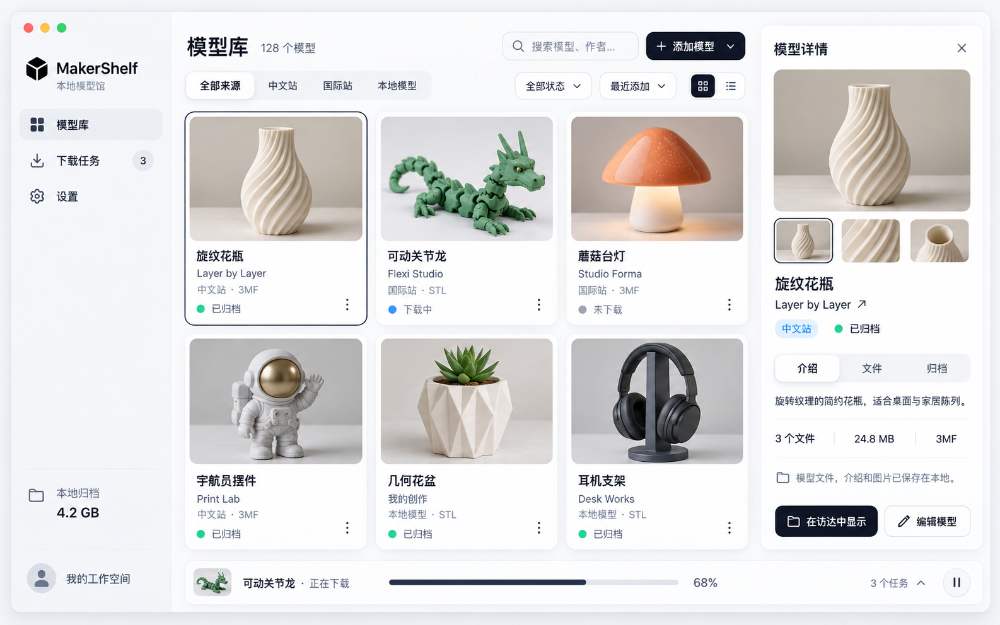

# MakerShelf 界面设计：Appica 风格 V2

状态：用户已确认采用，原生 SwiftUI 界面已按此方案落地，并打过 `1.1beta` 本地安装包。图中的模型数量、容量、作者、模型图片和下载进度均为示例数据，不是应用运行截图。

## 效果图与参考

参考：[Appica UI](https://appica.dev/ui)。本方案参考其浅灰背景、白色圆角卡片、细边框、柔和阴影及深墨色主按钮，保留 MakerShelf 品牌与 macOS 窗口特征。

## 功能去重

| 位置 | 调整 |
| --- | --- |
| 侧栏 | 只保留模型库、下载任务、设置三个主页面；删除“模型来源”分组及中文站、国际站、本地模型三个导航项。 |
| 模型库顶部 | 统一提供全部来源、中文站、国际站、本地模型筛选，以及状态、排序和视图切换。 |
| 其他已有筛选 | 作者和分类已放入按需展开的“更多筛选”面板，可单独重置；效果图展示常用控件，功能不因此删除。 |
| 卡片与详情 | 保留只读来源信息，帮助识别模型出处；这些标签不再承担第二组筛选功能。 |
| 添加模型 | 沿用统一导入窗口：模型链接、当前账号收藏或发布内容、指定作者公开发布模型、本地新建。 |
| 账号 | 中文站和国际站仍在设置中分别登录；账号连接与模型来源筛选是不同功能。 |
| 编辑模型 | 已归档的模型在详情栏提供编辑入口，继续保留右键入口。 |
| 下载摘要 | 底栏显示正在下载的项目、进度和暂停操作，点击任务摘要进入已有下载任务页。 |

“我的收藏”是从当前登录账号导入的内容范围；不把它设计成新的本地收藏系统。指定作者仍只支持读取公开发布作品。

## 视觉与布局

- 浅色三栏窗口：简洁导航、等尺寸模型网格、可收起的详情栏。
- 标题栏和侧栏采用轻毛玻璃，正文与卡片保持清楚可读的白底。
- 深墨色用于主按钮、图标和选中描边；绿色、蓝色、灰色用于状态表达。
- 卡片封面固定 4:3，信息区固定布局；图片加载、比例及标题长度不改变卡片尺寸。
- 不再加入上一版图中虚构的点赞、下载统计和 PDF 归档；介绍仍以已有 HTML 归档能力为准。
- 详情包含展示图片、介绍、文件和归档三个标签页，以及“在访达中显示”“编辑模型”。
- 窄窗口收起详情或减少网格列数，避免压缩卡片到无法阅读。

## 原生实现与性能处理

- 使用现有 SwiftUI 状态与服务，主窗口采用 NavigationSplitView；侧栏可以折叠，默认宽 218 点。Appica 仅作为视觉参考，不引入其网页组件。
- 主窗口默认 1560 × 980；内容区域不足 1060 点时取消常驻详情，点击卡片后使用原生 Sheet。较宽窗口使用 320 点的详情栏，关闭后可重新打开。
- 网格最小列宽 240 点，封面用 4:3 底板确定几何尺寸，图片叠放其上并等比缩放，标题和作者限制为单行。
- 保留惰性网格、分页加载和现有缩略图缓存；优先解码与展示尺寸匹配的图片。
- 缩略图尺寸桶为 160 / 320 / 640 / 1280；离屏释放视图图片，重新出现触发加载。图片加载、失败占位均不影响卡片尺寸。
- 毛玻璃限定在窗口边缘；“减少透明度”启用时侧栏改用实色。卡片、详情与表单采用实色表面，不额外加入运动效果。
- 下载摘要只在存在进行中、暂停或需处理任务时显示。摘要内容独立观察百分比；卡片只观察任务阶段，通过模型 ID 索引定位任务。
- 卡片显示真实文件类型，尚未解析时显示“模型文件”；本地创建预览标明“保存后归档”，不提前显示完成状态。
- 保留键盘操作、右键菜单、原生文件选择、拖放及访达定位。
- 设置、下载、添加模型和本地编辑统一使用共享颜色、按钮和卡片组件；登录和归档服务继续沿用现有实现。

## 本次续接与收尾

- 介绍页接入已有图文解析能力，按正文顺序展示文字和插图，不再只读取模型摘要。优先使用归档后改写的本地图片路径，过滤页面标题、样式、脚本与注释；未归档的远程图片仍需要网络。这是原生图文阅读，不还原网页中的复杂表格、视频或脚本交互。
- 320 点详情栏内的访达与编辑按钮上下排列；详情状态与卡片共用任务状态组件，有未完成任务时提供下载任务页入口。
- 窄窗口先关闭详情 Sheet，再执行编辑或任务页跳转；回调由 `onDismiss` 统一衔接。
- 底部摘要只选择每个模型最新的任务，防止新任务成功后重新显示旧失败记录。暂停全部仅在存在等待或运行任务时启用，失败和部分完成任务明确显示重试提示。
- 编辑已归档的站点模型时，预览保留中文站或国际站来源，不误标为本地新建模型。
- 图片缓存与在途请求都加入归档版本。相同路径的文件更新后，新视图不会复用旧版本的解码结果。

## 检查与验收边界

本轮完成差异格式检查与源码走查，核对了界面入口、筛选状态、详情关闭与再次打开、窄窗口详情转编辑和任务页、图文介绍的数据来源、任务操作回调、图片尺寸及模型状态的对应关系。此处核对的是源码路径，不代表已经操作应用验证。按用户要求没有编译、运行测试、启动应用、Git 提交或推送。

效果图作为布局依据；最终排版、原生分栏在不同系统版本下的行为、深色模式及性能仍需运行后验收，未提供实测性能结论。已有 v1.0 Release 保持原样。

## 生成记录

使用内置 image_gen 生图工具，参考图为 Appica 官网组件展示截图；本地效果图保存为 `docs/界面效果图-Appica-V2.png`。

### 最终生图提示词

用途：ui-mockup，高保真 macOS 原生桌面应用设计效果图。制作全新 MakerShelf 模型资料库的第二版界面，供用户确认，画面比例 16:10，清晰度以 2560×1600 为目标，中文文字尽量精确可读。
参考图片用途：最近一张图片是用户指定的 Appica UI 网站截图，只参考它的白色圆角卡片、浅灰底、极细边框、双层柔和阴影、近黑色文字及控件样式，不复制它的网页内容，不出现 Appica 标志、网站导航、财务图表、聊天框或者电商按钮。
视觉：整体明亮，冷白和雾灰，主按钮及选中状态为深墨黑 #111827；绿松石薄荷色只用于已归档/连接状态小圆点，浅冰蓝只用于少量标签。高度接近 Appica 的温柔精致 UI 控件风格：卡片 16px 圆角，按钮 10px 圆角，细描边，白卡片外有非常薄的浅灰第二层边缘及柔和阴影，不要夸张拟物。标题栏与侧栏使用浅色 macOS 毛玻璃而不是深灰色。圆润线性 SF Symbols 图标，SF Pro/PingFang 系统字体。平面正视图完整窗口，占画面约 96%，背景仅为安静纯浅灰，边距极小，窗口有真实微弱阴影；不要风景壁纸、电脑设备框、营销海报、图外标注。
功能根据现有 MakerShelf：模型库管理中文站、国际站和本地模型；搜索作者/模型、筛选、排序、网格/列表；统一添加入口支持模型链接、当前账号收藏或发布内容、指定作者公开作品、本地新建；详情包括介绍、展示图片、文件及本地归档，可编辑已归档模型，在访达中显示；下载任务支持暂停等。不要虚构云同步、AI、实时3D查看器、销量、点赞数、收藏切换或不存在的PDF导出。
构图：一个完整三栏 macOS 应用窗口。顶部左侧有红黄绿窗口控件，统一轻毛玻璃标题栏。左栏约 200px，中间约 890px，右栏约 330px。画面元素密度足够舒服，同时所有文字有空间不挤压，底部最后一排卡片完整显示。
左侧栏：小方形墨黑立方体线性logo加品牌“MakerShelf”，小字“本地模型馆”。只出现三个导航项：“模型库”高亮选中，“下载任务”末尾数字 3，“设置”。移除整个“模型来源”导航区，绝对不要在侧栏出现中文站/国际站/本地模型的来源菜单，也不要加入“已归档”“我的收藏”等重复筛选页面。侧栏中段保持安静留白，下方为简洁储存摘要“本地归档”“4.2 GB”以及微小文件夹图标，最下方灰色账号头像“我的工作空间”。
中央上部：左侧大约22px标题“模型库”与小号“128 个模型”；右侧搜索输入框“搜索模型、作者…”和墨黑主按钮“＋ 添加模型”带小下拉箭头。主按钮闭合，避免下拉遮盖网格。其下一行工具条左侧只有一组来源分段筛选“全部来源 / 中文站 / 国际站 / 本地模型”，其右侧两个紧凑下拉“全部状态”“最近添加”，再右侧网格/列表两个图标。来源筛选整个界面仅在这里出现一次。不要增加第二行重复筛选，不要营销大标题。
模型区：精确3列×2行，总计6张同尺寸卡片。每张约 270×290 的舒展卡片，固定4:3封面区和统一80px左右信息区；所有图片框、卡片底边、文字基线整齐对齐，不允许瀑布流。封面是清晰精美的3D打印制品真实产品照片、纯净哑光影棚底：第一张奶油白色竖向旋纹花瓶，第二张鼠尾草绿可动关节龙，第三张珊瑚橙与米白蘑菇灯，第二排分别为浅灰宇航员摆件、米白几何花盆、石墨色耳机支架。所有商品完整显示，保持主体合理且一致的视觉尺寸，图片略有粉彩配色但绝不要大片饱和渐变。每张信息区域标题、作者、小号来源文本与文件标签/归档状态：例如“旋纹花瓶”“Layer by Layer”“中文站 · 3MF”与带点“已归档”；“可动关节龙”“Flexi Studio”“国际站 · STL”与“下载中”；“蘑菇台灯”“Studio Forma”“国际站 · 3MF”与“未下载”；“宇航员摆件”“Print Lab”“中文站 · 3MF”“已归档”；“几何花盆”“我的创作”“本地模型 · STL”“已归档”；“耳机支架”“Desk Works”“本地模型 · STL”“已归档”。这些来源是只读元信息，不是重复过滤菜单。第一张选中，使用细墨灰描边，不用绿色边框。卡片没有爱心和虚构点赞下载统计。
右侧详情：独立柔和白色 Inspector，顶栏“模型详情”右侧关闭图标。大幅4:3第一张花瓶的同款图片，下方3张小图缩略图；然后标题“旋纹花瓶”，作者“Layer by Layer ↗”，细小“中文站”“已归档”状态。下一行分段“介绍 / 文件 / 归档”，选中介绍。简介“旋转纹理的简约花瓶，适合桌面与家居陈列。”。下方精简三列元信息“3 个文件”“24.8 MB”“3MF”。一条静态说明“模型文件、介绍和图片已保存在本地”。底部固定两行按钮：深墨黑“在访达中显示”与白色描边“编辑模型”按钮。右栏内容清楚有呼吸感，控制数量适度。不要发明 PDF 归档。
窗口底部横跨中间与右侧的窄下载状态栏，左侧小龙缩略图与文字“可动关节龙 · 正在下载”，中间细进度条 68%，右侧小号“3 个任务”与圆角小暂停按钮。它是队列状态摘要，不是新的重复导航。左侧底部不重复下载栏。最终要像真实可实现的 SwiftUI 原生专业工具截图，设计比上一版更统一、轻盈、简洁，清晰展现来源导航已被删除这一核心变化。
